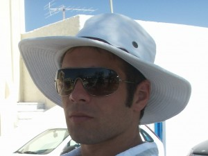


Welcome,
My name is Filippo De Luca,  I am "Just another passionate developer"  as states my blog.

My first software dates back to when I went to middle school.  Like many kids I was very lazy and when I discovered 
that my computer could work for me, I opened up a world.

I love technology in its essence and how it can change our lives. But at the same time I hate technology's sake. 
Technology can help us to save the planet from the dangers of global warming, we can help to combat issues such as 
world hunger. But if it is used for purely selfish purposes, it brings benefits to the few to the detriment of all 
others.

Actually I'm working at Moreover Technologies, a Media Monitoring company, to develop Newsdesk project. In the past 
I have worked for WURFL-Pro, a company born around the WURFL database and in various management software based on 
spring, Hibernate, JasperReports and Swing.

I like to do outdoor sports, I like nature, sea,  sailing and biking.  Unfortunately, I can hardly cultivate my 
passions because of the little free time available.
